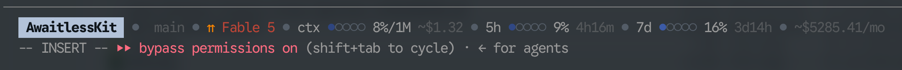

# Claude Counter

A statusline for [Claude Code](https://claude.ai/code) showing token usage, cost, and real rate limit utilization.



## Features

- **Current directory + model + reasoning effort** — At-a-glance context (read from `~/.claude/settings.json`, configurable icon presets)
- **Git branch + worktree** — On by default (shows `[worktree-name]` when in a linked worktree; `--no-git` to disable)
- **Token progress bar** — Context usage with color-coded warnings (blue → yellow → red)
- **Estimated API cost** — What this session would cost on the Anthropic API (per-model pricing with cache discounts)
- **Water footprint** — Estimated liters of water your tokens consume (data-center cooling + electricity generation), per session and per billing period
- **Session usage bar (5h)** — Rolling 5-hour rate limit utilization with reset countdown + accumulated API cost
- **Weekly usage bar (7d)** — Rolling 7-day rate limit utilization with reset countdown + accumulated API cost
- **Billing period total** — Accumulated cost for the current billing cycle (resets on configurable billing day)
- **6 bar styles** — `dots` (default), `text`, `bar`, `ball`, `capped`, `filled`
- **Style-matched separators** — Separator character matches the bar style (overridable)

## Installation

Add to `~/.claude/settings.json`:

```json
{
  "statusLine": {
    "type": "command",
    "command": "uvx --from git+https://github.com/bonkey/claude-counter-statusbar claude-counter"
  }
}
```

Or with `pipx`:

```json
{
  "statusLine": {
    "type": "command",
    "command": "pipx run --spec git+https://github.com/bonkey/claude-counter-statusbar claude-counter"
  }
}
```

### Options

| Flag | Default | Description |
|------|---------|-------------|
| `--style` | `dots` | Bar style: `text`, `bar`, `ball`, `capped`, `dots`, `filled` |
| `--separator` | *(matches style)* | Separator character between segments |
| `--git` / `--no-git` | on | Show current git branch |
| `--no-usage` | off | Disable rate limit usage bars |
| `--no-cost` | off | Disable estimated API cost display |
| `--no-total` | off | Disable billing period total cost display |
| `--no-water` | off | Disable estimated water footprint display |
| `--billing-day` | `1` | Day of month billing resets |
| `--effort-icons` | `arrows` | Effort preset (`arrows`, `circles`, `bubbles`, `style`) or custom icons comma-separated (one per tier, low→ultracode) |
| `--sync` | off | Scan historical transcripts to backfill cost data, then exit |

Example with all options:

```json
{
  "statusLine": {
    "type": "command",
    "command": "uvx --from git+https://github.com/bonkey/claude-counter-statusbar claude-counter --style=dots"
  }
}
```

### Bar styles

| Style | Bar | Separator |
|-------|-----|-----------|
| `dots` (default) | `●●●○○` | `●` |
| `bar` | `██░░░` | `█` |
| `ball` | `──●──` | `●` |
| `capped` | `━━╸┄┄` | `━` |
| `filled` | `■■□□□` | `■` |
| `text` | `~19.0k 40%` | `●` |

### Effort icon presets

Mirrors Claude Code's effort ramp `low · medium · high · xhigh · max`, plus
`ultracode` (shown in magenta) as the top state. `fastMode` is layered on top as
an orange ⚡ suffix when enabled.

| Preset | Low | Medium | High | xHigh | Max | Ultracode |
|--------|-----|--------|------|-------|-----|-----------|
| `arrows` (default) | ↓ | → | ↑ | ⇈ | ⇑ | ✦ |
| `circles` | ○ | ◐ | ● | ◉ | ◈ | ✦ |
| `bubbles` | 🫧 | 💭 | 🧠 | 🔥 | 🌋 | ✨ |
| `style` | `●○○○○○` | `●●○○○○` | … | … | … | `●●●●●●` (matches `--style`) |

Colors ramp green → red across the tiers, with ultracode in magenta.

Custom: `--effort-icons='○,◐,●,◉,◈,✦'` — one icon per tier (low→ultracode).
Fewer icons clamp to the last, so a future tier never renders blank.

### Alternative: install globally

```bash
pip install git+https://github.com/bonkey/claude-counter-statusbar
```

Then use `"command": "claude-counter"` (with any flags).

## How it works

Claude Code sends JSON via stdin after each assistant message. The script reads `context_window`, `model`, `workspace`, `rate_limits`, and `session_id` fields and renders a compact status line with ANSI colors. Reasoning effort is resolved like Claude Code's own logic: `ultracode` (from `~/.claude/settings.json`) wins, then the active per-turn effort (the `CLAUDE_EFFORT` env var, which reflects session overrides and can reach `max`), then the persisted `effortLevel` default in settings. `fastMode` from settings is shown as a ⚡ suffix.

Run `claude-counter --sync` to backfill historical costs from Claude Code transcripts (`~/.claude/projects/*/*.jsonl`). It also fetches the latest model pricing from [LiteLLM](https://github.com/BerriAI/litellm). Scans all sessions in the current billing period (deduplicated by request ID) and populates the cost state, including the accumulated water footprint. After that, costs accumulate automatically on each statusline update. Run periodically to keep pricing current.

Estimated API cost shows what the current session's token usage would cost on the Anthropic API, with per-model pricing (Opus/Sonnet/Haiku) and cache discounts (reads at 10%, writes at 125% of input price). Costs are accumulated across sessions in `~/.claude/.claude-counter-cost-state.json` — daily totals shown on the 5h bar, weekly totals on the 7d bar (auto-prunes after 7 days). Pricing source: [she-llac.com/claude-limits](https://she-llac.com/claude-limits).

### Water footprint

The `💧` segment estimates how many liters of water your token usage consumes, shown per session and accumulated per billing period (`💧1.4kL/mo`). The calculation has two steps: tokens → energy, then energy → water.

**Step 1 — tokens → energy.** The energy rates are anchored on the only published *measured* Claude figure: ["How Hungry is AI?" (2025)](https://arxiv.org/html/2505.09598v1) benchmarked Claude Sonnet at ~5.5 Wh for a 10k-input/1.5k-output query. Splitting that between prefill and decode (a decoded token costs roughly 10× a prefilled one — generation is sequential, prompt reading is parallel) gives:

| Token type | Energy | Why |
|------------|--------|-----|
| Input (plain or cache write) | 0.22 Wh / 1k | prefill compute |
| Cache read | 0.022 Wh / 1k | skips prefill — same 10% factor the cost estimate uses |
| Output | 2.2 Wh / 1k | sequential decode, ~10× prefill per token |

Those are Sonnet-class rates. Other Anthropic tiers are scaled by their API input price relative to Sonnet's $3/MTok, as a rough proxy for model compute: Haiku ⅓×, Opus 1.67×, Fable 3.33×.

**Step 2 — energy → water.** Data centers consume water in two places, added up per the standard academic model ([Li et al. 2023](https://arxiv.org/pdf/2304.03271)):

```
water = energy × (WUE_onsite / PUE + WUE_offsite)
      = energy × (0.30 / 1.12  +  3.14)  ≈  energy × 3.4 L/kWh
```

- `WUE_onsite` = 0.30 L/kWh — water evaporated by the data center's own cooling towers, per unit of *total facility* energy. Dividing by `PUE` = 1.12 (power usage effectiveness, facility energy ÷ server energy) converts it to per-server-energy terms.
- `WUE_offsite` = 3.14 L/kWh — water evaporated generating the electricity itself (hydro reservoirs, thermal plant cooling; US grid average). This term dominates ~12:1.

**Worked example** — a Fable 5 session with 10k plain input, 20k cache-write, 120k cache-read, and 20k output tokens:

```
energy = 3.33 × (10 × 0.22  +  20 × 0.22  +  120 × 0.022  +  20 × 2.2)   [Fable scale × Wh]
       = 3.33 × (2.2 + 4.4 + 2.64 + 44) = 3.33 × 53.2 Wh ≈ 177 Wh
water  = 0.177 kWh × 3.4 L/kWh ≈ 0.6 L   →   💧605mL
```

Note that output tokens dominate the footprint even though input tokens dominate the count — and cache reads, the bulk of a Claude Code session, are nearly free.

Treat it as an order-of-magnitude estimate: published figures span ~1000× depending on scope — [Google reports 0.26 mL per median Gemini prompt](https://cloud.google.com/blog/products/infrastructure/measuring-the-environmental-impact-of-ai-inference) (onsite cooling only), while [Mistral's full lifecycle analysis](https://mistral.ai/news/our-contribution-to-a-global-environmental-standard-for-ai/) reports 45 mL per 400-token response (includes amortized training and hardware). This estimate sits in between, counting cooling + electricity generation but not hardware manufacturing or training. Disable with `--no-water`.

### Pricing

Model pricing is fetched automatically from [LiteLLM](https://github.com/BerriAI/litellm) and cached in `~/.claude/.claude-counter-pricing-cache.json` (refreshed every 24 hours). The refresh runs in a **detached background process** — the status line itself never makes a blocking network call, so a slow or failing network can't stall or garble rendering. (Attempts are throttled to once per hour and tracked in `~/.claude/.claude-counter-pricing-refresh`.)

Rate limit utilization (session 5h and weekly 7d) is read from the native `rate_limits` field provided by Claude Code ≥2.1.80. If the field is absent (older versions), usage bars are simply not shown.

### Terminal rendering

The status line is built to be safe for Claude Code's TUI renderer: it emits a **single line** of plain text plus SGR colour codes only — no cursor-movement, screen-clear, OSC, or other escape sequences. Externally-sourced text (git branch, directory, model name) is stripped of control characters before display, and the whole line is truncated to the terminal width Claude Code reports via `COLUMNS` (with an `…` ellipsis) so it never wraps onto a second row. The default `arrows` effort preset and the geometric bar glyphs are width-safe; the `bubbles` preset, the `⚡` fastMode suffix, and the `💧` water indicator use full-width emoji, whose rendered width some terminals measure differently.

> If you still see garbled/duplicated status lines, it's most likely a Claude Code renderer issue rather than this script — try updating Claude Code, setting `CLAUDE_CODE_DISABLE_NONESSENTIAL_TRAFFIC=1`, or `/clear`.

## Credits

- Original browser extension by [shellac](https://github.com/she-llac)
- Bar styles and separator concept from [claude-powerline](https://github.com/Owloops/claude-powerline) by Owloops
- Rewritten as Claude Code statusline by [Claude](https://claude.ai) (Anthropic)
- Inspired by [Claude Usage Tracker](https://github.com/lugia19/Claude-Usage-Extension) by lugia19

## License

MIT
